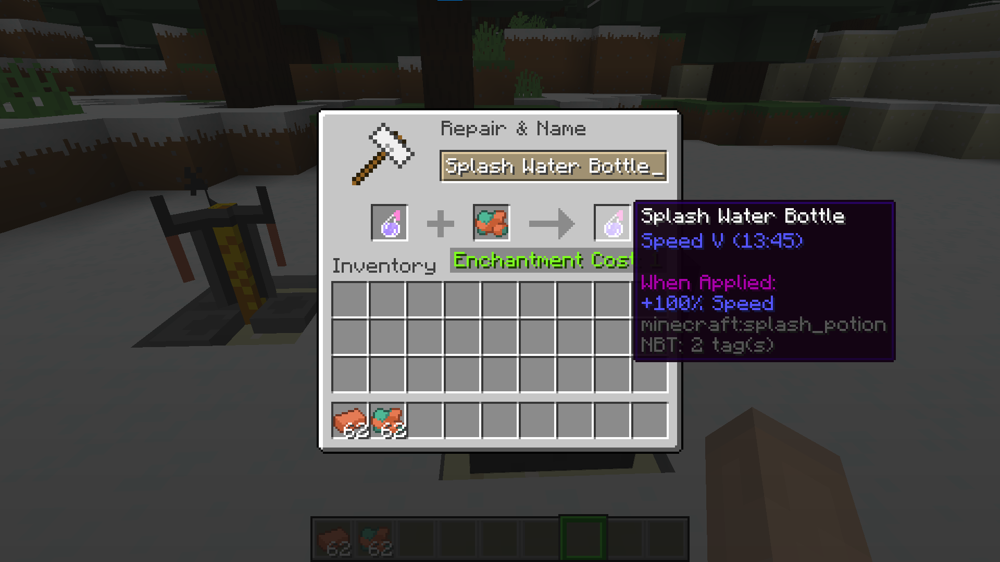

# Stronger Potions Minecraft Spigot Plugin

This plugin allows you to infinitely increase the potency and duration of each potion effect using an anvil. When a vanilla potion is being upgraded for the first time, its potion data will be hardcoded to the value below depending on the material used, and whether the potion had already been upgraded with glowstone or redstone. Its vanilla effect will be removed and added as a custom effect.

| Potion Used                   | Material Used           | Result                                                       |
| ----------------------------- | ----------------------- | ------------------------------------------------------------ |
| Potion with default duration  | Raw Copper              | Increase duration to  7.5 minutes                            |
| Potion with extended duration | Raw Copper              | Increase duration to 12.5 minutes                            |
| Custom effect potion          | Raw Copper              | Increase duration by 5 minutes                               |
| Level 1 potion                | Copper Ingot            | Upgrade to level 3                                           |
| Level 2 potion                | Copper Ingot            | Upgrade to level 4                                           |
| Custom effect potion          | Copper Ingot            | Upgrade by 1 level                                           |
| Any potion with effects       | Any potion with effects | Effects are merged into a single potion of the same type as the first potion |
| Any potion with effects       | Diamond Block           | Potion is set to a stack size of 64                          |

# Roadmap

- [x] Combine potions to merge effects
- [x] Set potion stack size to 64 with diamond block
- [ ] Add configuration file for materials and experience level required for upgrades